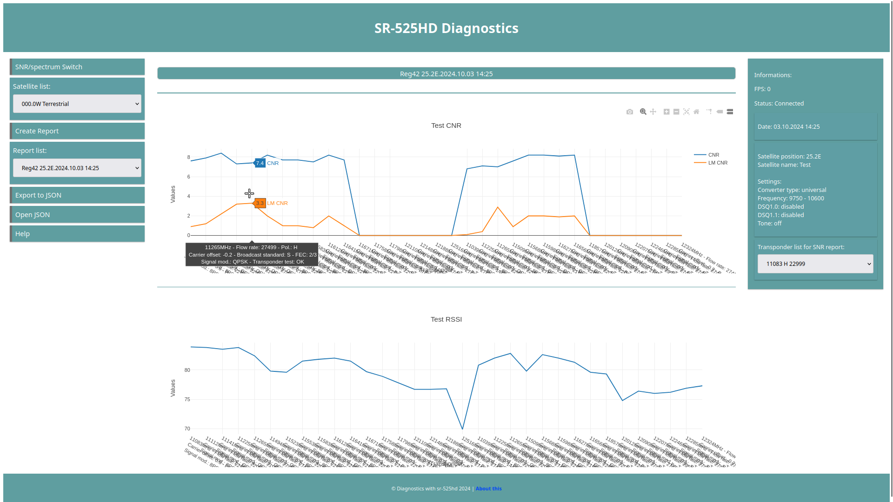
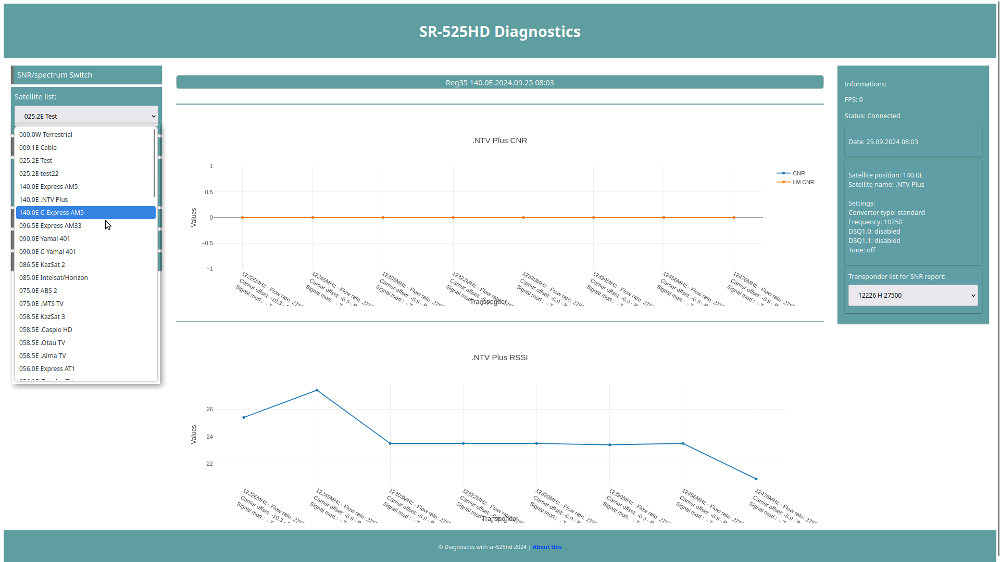
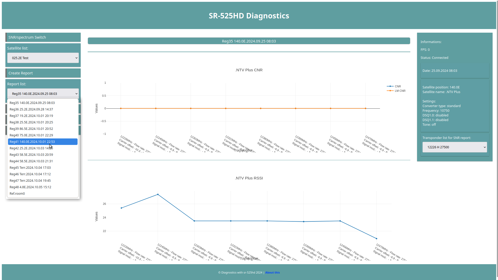
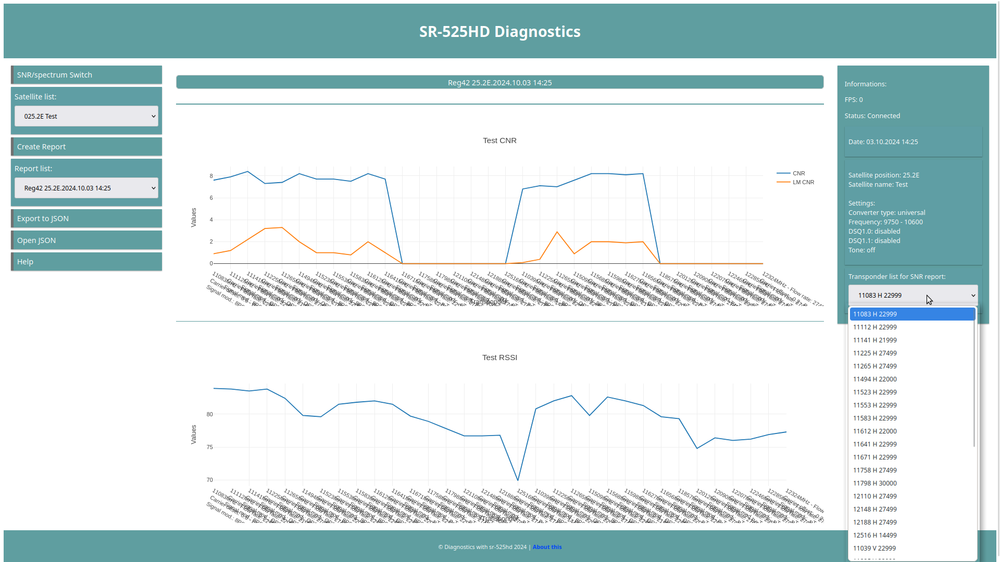
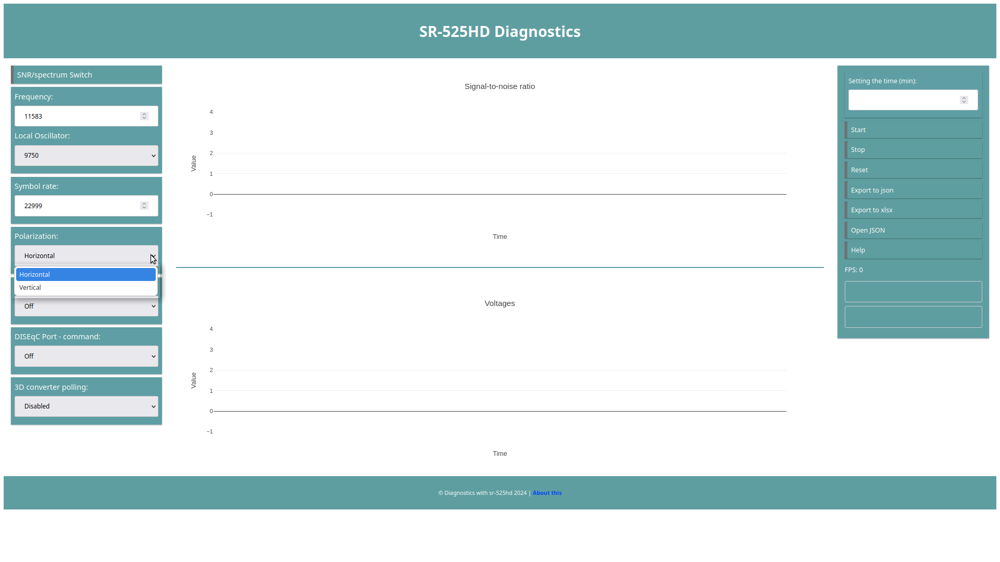
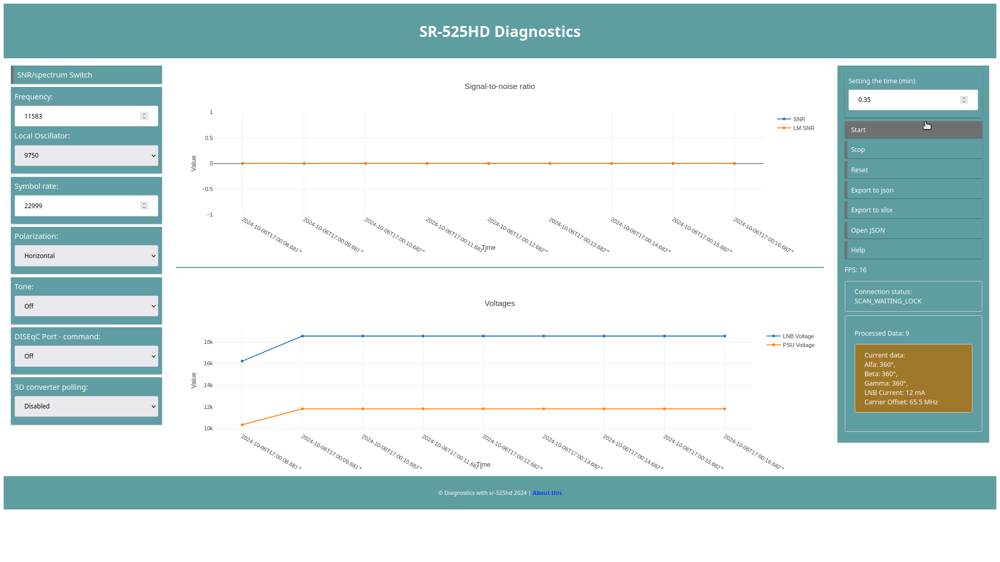
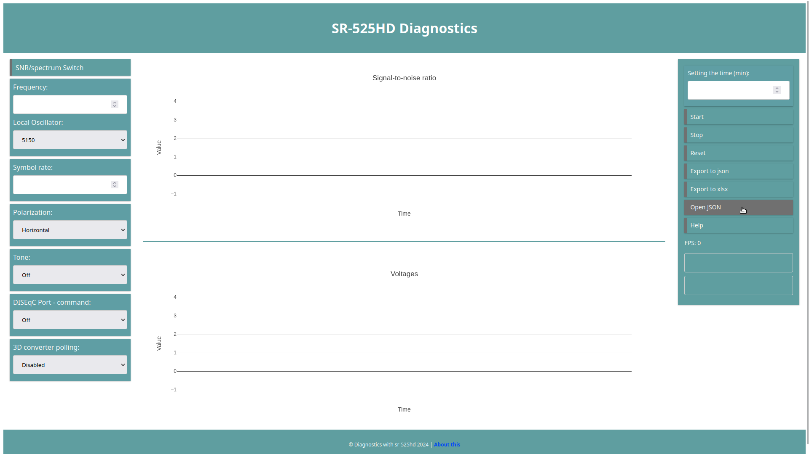
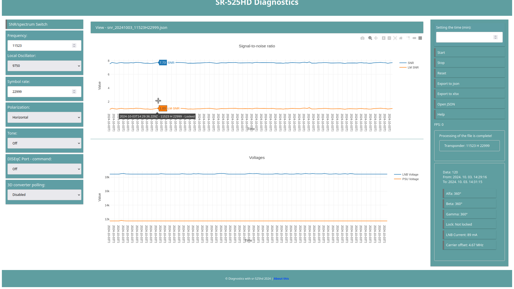

# R.A.M.F. Diagnostic

> Chrome Extension for satellite set-top box diagnostics — Spectrum Report and SNR monitoring for the **Goldmaster SR-525HD** device.

[](https://www.gnu.org/licenses/gpl-3.0)
[](https://developer.chrome.com/docs/extensions/mv3/)
[](https://github.com/Csnyi/RAMFstbDiagnostic)

-----

## Table of Contents

- [Overview](#overview)
- [Features](#features)
- [Screenshots](#screenshots)
- [Requirements](#requirements)
- [Installation](#installation)
- [Usage](#usage)
- [Project Structure](#project-structure)
- [Tech Stack](#tech-stack)
- [Security Notice](#security-notice)
- [License](#license)

-----

## Overview

**R.A.M.F. Diagnostic** is a Chrome browser extension designed to monitor and diagnose satellite set-top boxes on a **local internal network**. It connects to the device via its IP address and provides real-time SNR (Signal-to-Noise Ratio) measurements, spectrum analysis, and detailed transponder reports — all from within the browser.

The extension is intended for use by satellite technicians and enthusiasts who want a convenient, browser-based diagnostic interface for the SR-525HD device.

> **Documentation & Live Demo:** <https://csnyi.github.io/RAMFstbDiagnostic/>

-----

## Features

- 📡 **SNR Monitoring** — Real-time Signal-to-Noise Ratio measurement with live chart rendering
- 📊 **Spectrum Report** — Full transponder spectrum scan with graphical output (CNR and RSSI)
- 🛰️ **Satellite & Transponder Management** — Select and manage satellite lists with transponder parameters
- 💾 **Report Storage** — Save and reload measurement reports locally using IndexedDB (Dexie.js)
- 📤 **Export** — Export measurement data to JSON or Excel (XLSX) format
- 📂 **Import** — Load previously exported JSON reports back into the interface
- 📈 **Interactive Charts** — Plotly.js-powered zoomable and scrollable data visualizations
- 🔌 **DiSEqC Support** — DiSEqC 1.0 and 1.1 switch configuration support
- ⚙️ **Flexible Tuning Parameters** — Frequency, symbol rate, polarization, LNB voltage, tone, modulation

-----

## Screenshots

|View                                     |Description          |
|-----------------------------------------|---------------------|
|             |Home — Report diagram|
|   |Satellite list       |
|      |Report list          |
| |Transponder list     |
|   |SNR parameters       |
|   |Running report       |
|        |Open JSON            |
||Saved report view    |

-----

## Requirements

- **Browser:** Google Chrome (Manifest V3 compatible)
- **Device:** Goldmaster SR-525HD set-top box
- **Network:** The device and the computer running Chrome must be on the **same local network**

-----

## Installation

Since this extension is not published to the Chrome Web Store, it must be loaded manually as an unpacked extension.

1. **Download or clone** this repository:
   
   ```bash
   git clone https://github.com/Csnyi/RAMFstbDiagnostic.git
   ```
1. Open Chrome and navigate to:
   
   ```
   chrome://extensions/
   ```
1. Enable **Developer mode** (toggle in the top-right corner).
1. Click **“Load unpacked”** and select the root folder of this repository (the one containing `manifest.json`).
1. The extension will appear in your Chrome toolbar.

-----

## Usage

1. **Connect** — Enter the IP address of your SR-525HD device and click the *Connection* button. The extension will attempt to connect to the device on your local network.
1. **Spectrum Report** — Once connected, select a satellite from the list and click *Create Report* to start a full transponder scan. The results are displayed as interactive CNR and RSSI charts.
1. **SNR Measurement** — Switch to SNR mode, enter the transponder parameters (frequency, symbol rate, polarization, LNB settings, DiSEqC port), and optionally set a measurement duration in minutes. Click *Start* to begin live SNR monitoring. Click *Stop* to end the measurement.
1. **Export** — After a measurement, export the collected data to JSON (for later re-import) or directly to an Excel file.
1. **Load Saved Reports** — Use *Open JSON* to load a previously exported report and re-view the charts and data tables.

> **Note:** If no measurement duration is set, the SNR measurement runs until you manually stop it with the *Stop* button.

-----

## Project Structure

```
RAMFstbDiagnostic/
├── manifest.json           # Chrome Extension Manifest V3
├── index.html              # Extension popup entry point
├── html/
│   └── main.html           # Main application UI
├── css/
│   ├── app.css             # Main application styles
│   ├── modal.css           # Modal dialog styles
│   └── dataTables.css      # DataTables styles
├── js/
│   ├── background.js       # Service worker (background script)
│   ├── jquery-2.1.3.min.js
│   ├── dataTables.min.js
│   ├── plotly-2.35.2.min.js
│   ├── xlsx.full.min.js
│   ├── dexie/              # IndexedDB wrapper
│   └── api/
│       ├── about_this.js   # About modal content
│       ├── modal.js        # Modal UI logic
│       ├── report_main.js  # Spectrum report logic
│       ├── snr_app.js      # SNR measurement logic
│       ├── snr_view.js     # SNR data visualization
│       └── storage.js      # Local data persistence
├── images/                 # Extension icons
└── docs/                   # GitHub Pages documentation site
    ├── index.html
    ├── css/
    ├── js/
    └── doc_img/            # Documentation screenshots
```

-----

## Tech Stack

|Technology                                        |Role                                            |
|--------------------------------------------------|------------------------------------------------|
|HTML / CSS / JavaScript                           |Core extension (56.6% JS, 32.6% CSS, 10.8% HTML)|
|[jQuery 2.1.3](https://jquery.com)                |DOM manipulation                                |
|[Plotly.js 2.35.2](https://plotly.com/javascript/)|Interactive charting                            |
|[SheetJS](https://sheetjs.com)                    |Excel export                                    |
|[DataTables](https://datatables.net/)             |Tabular data display                            |
|[Dexie.js](https://dexie.org)                     |IndexedDB wrapper for local storage             |
|[W3.CSS](https://www.w3schools.com/w3css/)        |Documentation site styling                      |

-----

## Security Notice

⚠️ This extension is designed exclusively for use on a **local internal network**.

It does **not** implement authentication or encryption. **Do not expose your SR-525HD device to the public internet** while using this extension. If you do so, take appropriate security precautions.

-----

## License

Copyright (C) 2024 [Csnyi](https://github.com/Csnyi)

This program is free software: you can redistribute it and/or modify it under the terms of the **GNU General Public License v3.0** as published by the Free Software Foundation.

See the <LICENSE> file for details, or visit <https://www.gnu.org/licenses/>.
